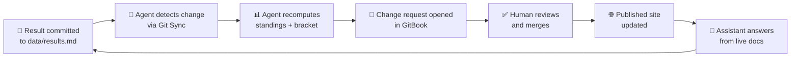

# How This Works

This site is a live demo of GitBook Agent maintaining documentation against a changing source. The same motion as keeping docs current with a moving codebase — running on the most perishable document we could find.

---

## The Loop

Two readings of the same loop:

| In your codebase | In this site |
|------------------|-------------|
| Dev commits a change to source | A match result is committed to `data/results.md` |
| Agent detects the change | Agent detects the commit via Git Sync |
| Agent updates every affected page | Agent recomputes standings, rewrites bracket, updates leaderboard |
| Change request opened | Change request opened in GitBook |
| Human reviews + merges | Same — one click |
| Published site stays current | Bracket is correct by 7am in Paris |
| Readers and agents consume it | Assistant answers "who's alive in Group D?" |

---

## What each page is



**`data/results.md`** — The only page you touch. One commit per matchday.

**`team/predictions.md`** — Written in the visual editor, no Git required.



**`groups/standings.md`** — Recomputed after every group stage matchday.

**`knockout/bracket.md`** — Redrawn after every knockout round.

**`team/leaderboard.md`** — Updated after each knockout round.



**`how-it-works/the-loop.md`** — This page. Doesn't change.

**`README.md`** — Homepage. The zero-edits counter updates via a space variable.



---

## Why a World Cup bracket?

A World Cup bracket is the most aggressively perishable document there is. It goes stale every night of the group stage. Which makes it the most literal demo of "docs that don't rot" you could stage — not a metaphor, an actual living document rotting in real time unless something keeps it current.



### The problem it mirrors

Your codebase ships every week. Your docs fall behind. Six months later, a developer follows an outdated guide and loses an hour. The cost is invisible until it isn't.



### The solution it demonstrates

One source of truth. An Agent that watches the source and proposes updates. A human who merges them. Docs that are accurate by default, not by heroic effort.



---

## The honest wiring


**The Agent proposes — a human merges.** GitBook Agent doesn't silently auto-publish. It opens a change request that someone reviews and approves. For this site, that takes about 30 seconds each matchday. For your codebase, it's the same motion: the Agent does the analysis, you keep the authority.


The "2am, nobody awake" story is real — the Agent opens the change request while Europe sleeps. But someone still clicks merge in the morning. That's not a limitation; it's a feature. You'd never want undisclosed changes going out without a human in the loop.

---

## Try it now

Ask the Assistant (bottom-right) anything about the tournament:

* *"Who's still alive in Group D?"*
* *"Which teams have qualified for the knockouts?"*
* *"What does Spain need to qualify?"*

The Assistant reads from these pages — so its answers are only ever as good as how current the docs are. That's the point.
